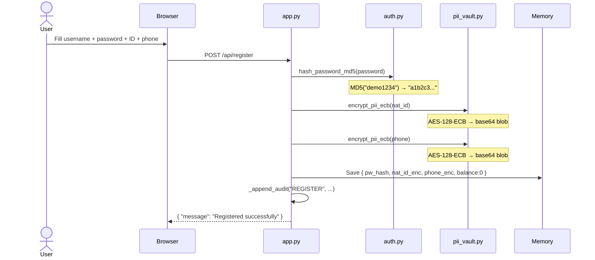
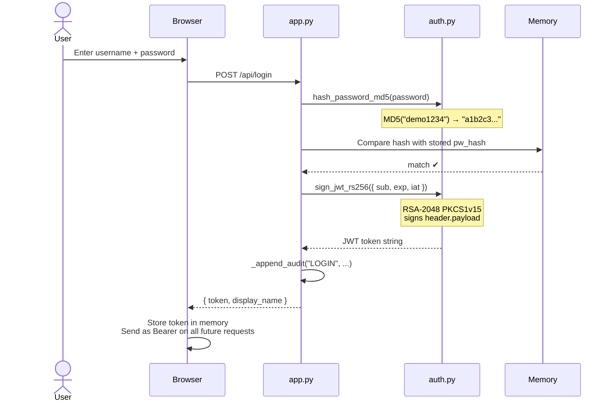
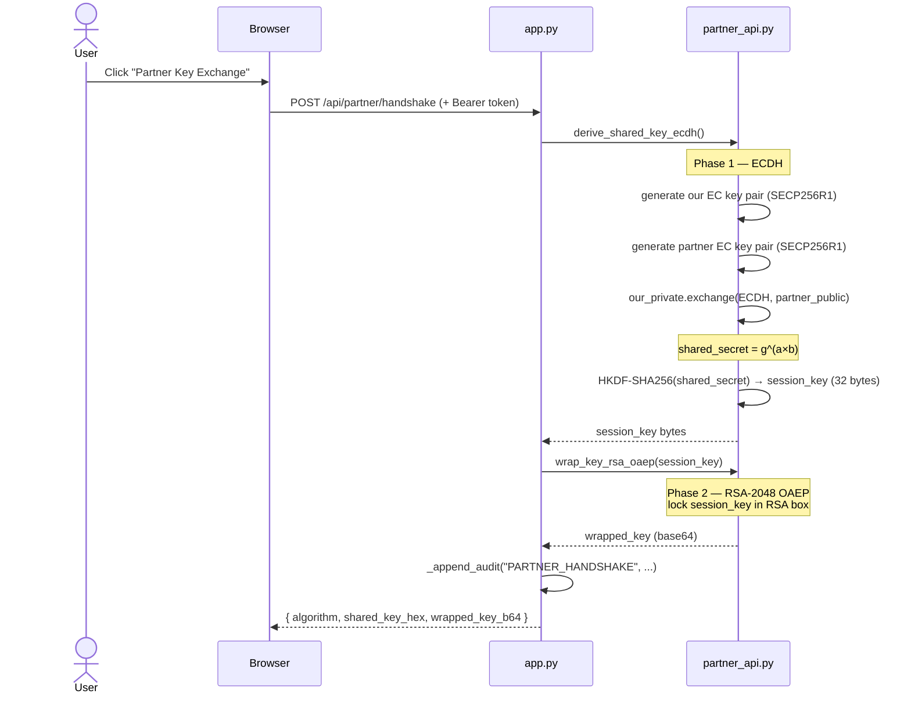
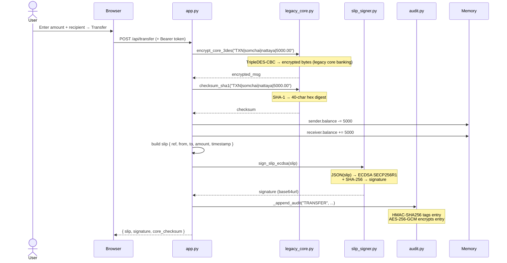
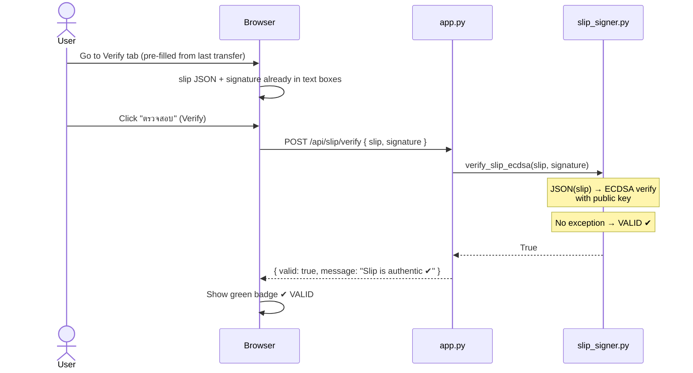
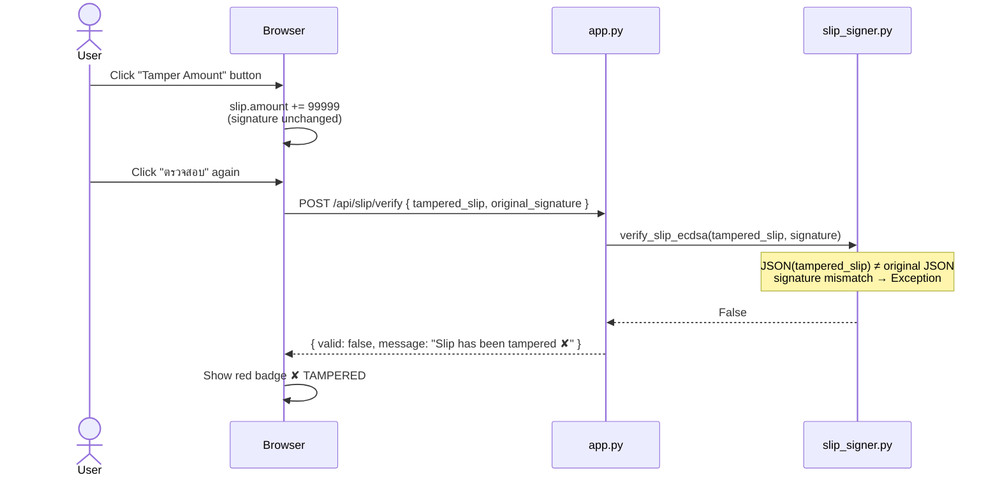
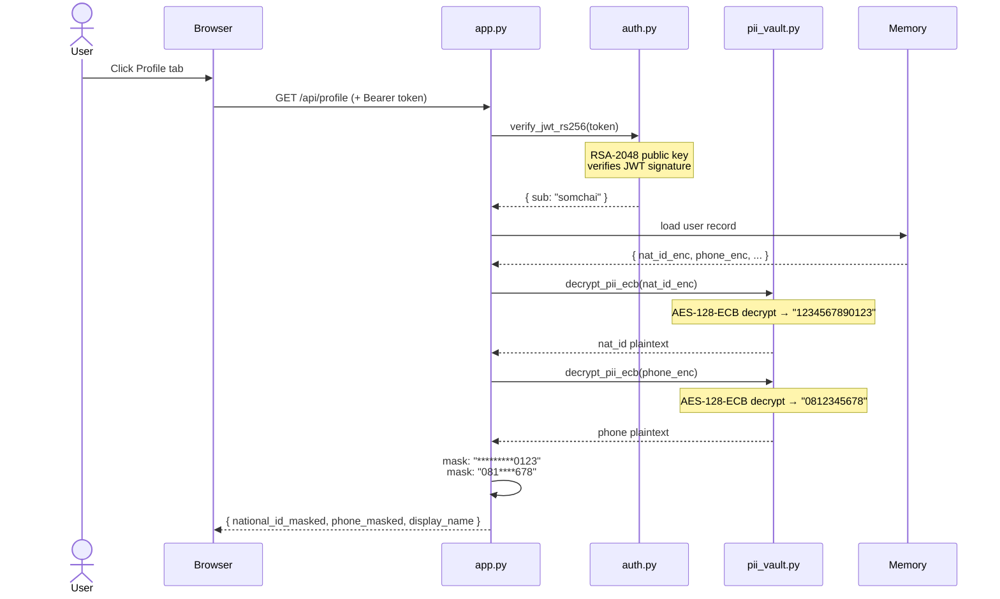
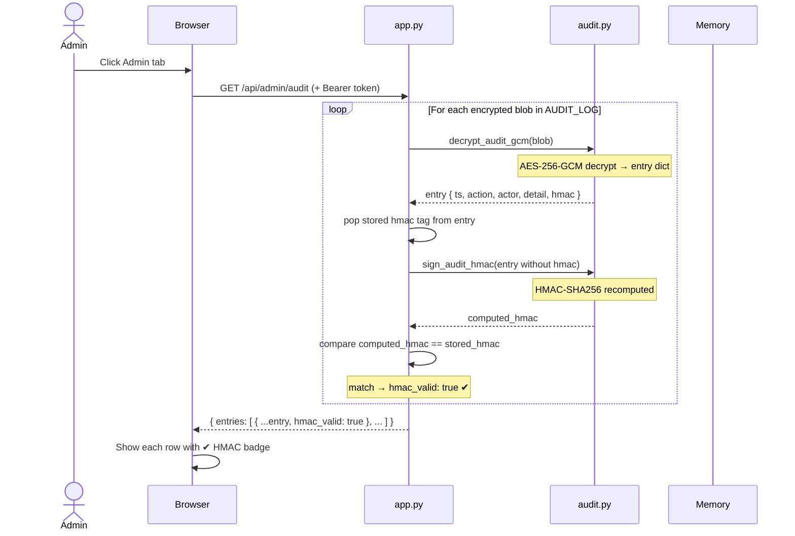
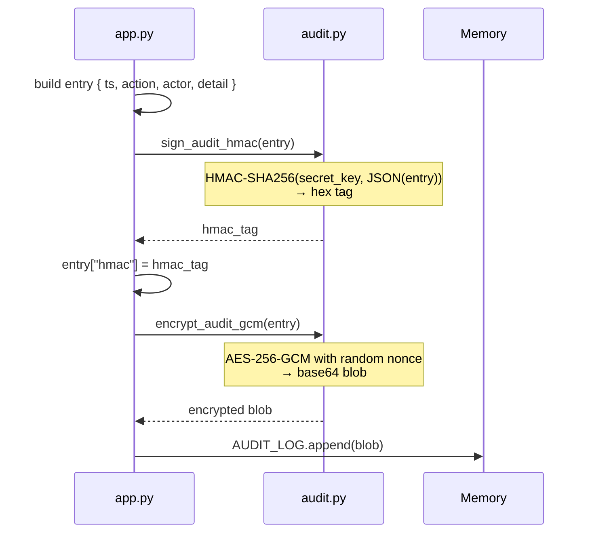

# ThaiPay Lite — Cryptography Knowledge Guide

> A complete recap of every concept covered during the QSE presales demo session.
> Written to be read independently — no prior session needed.

---

## Table of Contents

1. [App Overview](#1-app-overview)
2. [Demo Flow Summary](#2-demo-flow-summary)
3. [Step 1 — Login & JWT (RSA-2048)](#3-step-1--login--jwt-rsa-2048)
4. [Step 2 — Partner Key Exchange (ECDH + RSA-OAEP)](#4-step-2--partner-key-exchange-ecdh--rsa-oaep)
5. [Step 3 — Transfer (3DES + SHA-1 + HMAC)](#5-step-3--transfer-3des--sha-1--hmac)
6. [Step 4 — Verify Slip (ECDSA)](#6-step-4--verify-slip-ecdsa)
7. [Step 5 — Profile (AES-128 ECB)](#7-step-5--profile-aes-128-ecb)
8. [Step 6 — Admin Audit Log (HMAC-SHA256 + AES-256-GCM)](#8-step-6--admin-audit-log-hmac-sha256--aes-256-gcm)
9. [Crypto Inventory — Full CBOM Table](#9-crypto-inventory--full-cbom-table)
10. [Why Quantum Computers Break These](#10-why-quantum-computers-break-these)
11. [Feature by Feature Flow (Sequence Diagrams)](#11-feature-by-feature-flow-sequence-diagrams)

---

## 1. App Overview

**ThaiPay Lite** is a mini mobile-banking web app built specifically so IBM Quantum Safe Explorer (QSE) can scan it and produce a **Cryptography Bill of Materials (CBOM)** — a full inventory of every cryptographic algorithm used in the codebase.

The app intentionally uses **weak and quantum-vulnerable cryptography** as demo findings. All algorithms are real and functional, not mocked.

```
thaipay-lite/
├── frontend/index.html          ← Single-page banking UI (vanilla JS)
└── backend/
    ├── app.py                   ← FastAPI routes
    └── crypto/
        ├── auth.py              ← MD5 password hash + RSA-2048 JWT
        ├── slip_signer.py       ← ECDSA slip signing + verify
        ├── pii_vault.py         ← AES-128-ECB for national ID / phone
        ├── partner_api.py       ← ECDH + RSA-OAEP partner handshake
        ├── legacy_core.py       ← 3DES-CBC + SHA-1 legacy core banking
        └── audit.py             ← HMAC-SHA256 + AES-256-GCM audit log
```

**Two demo users seeded at startup:**

| Username | Password | Balance |
|---|---|---|
| somchai | demo1234 | ฿125,000.00 |
| nattaya | demo5678 | ฿58,500.50 |

---

## 2. Demo Flow Summary

```
1. Login (somchai / demo1234)
   → RSA-2048 PKCS1v15 JWT issued

2. Home → click Partner Key Exchange
   → ECDH-SECP256R1 + HKDF-SHA256 + RSA-2048-OAEP summary shown

3. Transfer ฿5,000 to nattaya
   → 3DES-CBC legacy core call + SHA-1 checksum
   → ECDSA-signed e-Slip returned

4. Slip tab
   → QR code rendered from slip summary

5. Verify tab → pre-filled → ✔ VALID

6. Click Tamper Amount → verify again → ✘ TAMPERED

7. Profile tab
   → masked national ID + phone (AES-128-ECB decrypted server-side)

8. Admin tab
   → audit log rows with HMAC-SHA256 ✔ badges
```

---

## 3. Step 1 — Login & JWT (RSA-2048)

### What Happens

1. User submits username + password
2. Password is hashed with **MD5** and compared to stored hash
3. If match → server issues a **JWT token** signed with **RSA-2048**
4. Browser stores the token and sends it in every subsequent request

### MD5 Password Hashing

**MD5** produces a fixed 32-character fingerprint of any input.

```
"demo1234"  →  MD5  →  "533f6357b79a1f8e5a4e7c6a0b8c3d2e"
```

- Same input always gives same output
- Cannot be reversed (one-way)
- **Weak**: MD5 is broken — collision attacks exist, rainbow tables make it easy to crack
- **QSE flags this** as a vulnerable hash algorithm

### JWT Token (RSA-2048 PKCS1v15)

JWT = JSON Web Token. Structure:

```
header.payload.signature
  ↓        ↓         ↓
base64   base64   RSA-2048
                  signature
```

```
eyJhbGciOiJSUzI1NiJ9  .  eyJzdWIiOiJzb21jaGFpIn0  .  [RSA signature]
      header                     payload                    signature
```

- **Header**: algorithm name (`RS256`)
- **Payload**: who you are (`sub: somchai`), expiry time
- **Signature**: RSA-2048 private key signs `header.payload` → proves it came from the bank

### Why RSA-2048 Is Quantum-Vulnerable

RSA security relies on the difficulty of **factoring large numbers**:

```
Public key  =  p × q   (two huge prime numbers multiplied together)
Private key =  knowing p and q separately

Classical computer:  factoring p×q takes longer than age of universe
Quantum computer:    Shor's algorithm factors it in minutes ← the threat
```

**File:** `backend/crypto/auth.py`

---

## 4. Step 2 — Partner Key Exchange (ECDH + RSA-OAEP)

### What Problem It Solves

When Bank A (ThaiPay) needs to send a transaction to Bank B (KBank), they must first agree on a **shared encryption key** — without ever sending that key over the network where attackers could intercept it.

### There Are TWO Separate ECDH Conversations

| | ECDH #1 | ECDH #2 |
|---|---|---|
| **Who** | Your phone ↔ Bank A | Bank A ↔ Bank B |
| **Why** | Secure your app connection | Secure interbank transaction channel |
| **Visible?** | Never — automatic TLS/HTTPS | Never — pure server-to-server |
| **In ThaiPay demo** | Automatic (browser ↔ uvicorn) | 🎯 The Partner Key Exchange button |

> **Partner Key Exchange button = Bank-to-Bank (ECDH #2)**

### What Is a Session Key?

A **session key** is a temporary, one-time encryption key:

| | Permanent Key | Session Key |
|---|---|---|
| **If stolen** | ALL past + future messages exposed | Only that one session exposed |
| **Valid for** | Forever | Minutes or hours |
| **Reused?** | Yes | No — new key every connection |

This property is called **Forward Secrecy** — past sessions stay safe even if future keys are stolen.

### Phase 1 — ECDH (Agree on Shared Key)

#### The Paint Mixing Analogy

```
Everyone agrees on a starting colour: YELLOW (public)

ThaiPay picks secret: RED   (never shared)
KBank picks secret:   BLUE  (never shared)

ThaiPay sends out:  YELLOW + RED  = ORANGE  (public, anyone can see)
KBank sends out:    YELLOW + BLUE = GREEN   (public, anyone can see)

ThaiPay takes KBank's GREEN  + own RED  → BROWN ✅
KBank takes ThaiPay's ORANGE + own BLUE → BROWN ✅

Both arrive at BROWN — the shared secret — without ever sending RED or BLUE!
```

#### Why Both Sides Get the Same Result

The math uses **modular exponentiation**. Example with small numbers:

```
Public values: base g = 5, modulus p = 23

ThaiPay secret: a = 6     →  sends A = 5^6  mod 23 = 8
KBank secret:   b = 15    →  sends B = 5^15 mod 23 = 19

ThaiPay computes: B^a mod 23 = 19^6  mod 23 = 2  ✅
KBank computes:   A^b mod 23 = 8^15  mod 23 = 2  ✅
```

They're equal because:

```
B^a = (g^b)^a = g^(b×a)
A^b = (g^a)^b = g^(a×b)

g^(a×b) = g^(b×a)  ← multiplication is commutative
```

**Multiplication order doesn't matter → both sides always arrive at the same result.**

#### In Code (`partner_api.py`)

```python
our_private     = ec.generate_private_key(ec.SECP256R1(), ...)   # ThaiPay's secret (a)
partner_private = ec.generate_private_key(ec.SECP256R1(), ...)   # KBank's secret (b)
partner_public  = partner_private.public_key()                    # KBank's public (g^b)

shared_secret = our_private.exchange(ec.ECDH(), partner_public)   # = g^(ab)

derived_key = HKDF(algorithm=hashes.SHA256(), length=32)          # polish into clean key
              .derive(shared_secret)
```

#### ECDH Is a Recipe Made of Multiple Crypto Ingredients

```
ECDH (the recipe)
 ├── SECP256R1    → the elliptic curve shape used for key math
 ├── SHA-256      → inside HKDF, polishes raw secret into usable key
 └── RSA-2048     → wraps the key for safe delivery (Phase 2)
```

| Ingredient | Job | Quantum-vulnerable? |
|---|---|---|
| SECP256R1 | Curve for key generation and math | ✅ Yes — Shor's algorithm |
| HKDF-SHA256 | Derive clean session key | ❌ No — safe |
| RSA-2048 OAEP | Wrap key for delivery | ✅ Yes — Shor's algorithm |

### Phase 2 — RSA-OAEP (Deliver the Key Safely)

Once the session key is derived, wrap it in an RSA "locked box":

```python
wrapped = _partner_rsa_public.encrypt(
    session_key,
    padding.OAEP(mgf=padding.MGF1(algorithm=hashes.SHA256()), ...)
)
```

- Anyone can see the `wrapped_key_b64` blob — it's safe to transmit publicly
- Only **KBank's RSA private key** (never leaves the server) can unlock it

### What the UI Shows vs What Stays Private

| UI Field | Visible? | What it is |
|---|---|---|
| `algorithm` | 🌐 Public | Just a label |
| `shared_key_hex` | ⚠️ Demo only | The actual session key — **never shown in real systems** |
| `wrapped_key_b64` | 🌐 Public (safe) | Session key locked in RSA box — useless without private key |

### Real-World Use Cases of ECDH

| Use Case | Where ECDH runs |
|---|---|
| Opening any HTTPS website | TLS handshake — automatic, ~50ms |
| Opening KBank mobile app | TLS handshake before login screen appears |
| PromptPay interbank transfer | Clearing house server-to-server |
| WhatsApp / LINE messages | End-to-end encryption protocol |

> **Every time you open KBank app, ECDH runs automatically before you see the login screen. You never notice it.**

### The Three Layers (Your Mental Model)

```
Business Layer  →  Partner Key Exchange (Bank A talks to Bank B securely)
Protocol Layer  →  ECDH (the method that makes it secure)
Crypto Layer    →  SECP256R1 + SHA-256 + RSA-2048 (the building blocks)

QSE scans at the Crypto Layer → finds each primitive → lists in CBOM
```

**File:** `backend/crypto/partner_api.py`

---

## 5. Step 3 — Transfer (3DES + SHA-1 + HMAC)

### What Happens on Each Transfer

```
User clicks Transfer
    │
    ├─→ Legacy core-banking call
    │       encrypt message with 3DES-CBC        (simulates mainframe call)
    │       compute SHA-1 checksum of message    (simulates legacy integrity check)
    │
    ├─→ Update balances in memory
    │
    ├─→ Build slip dict → sign with ECDSA        (see Step 4)
    │
    └─→ Write to audit log
            HMAC-SHA256 signs the entry           (see Step 6)
            AES-256-GCM encrypts the entry
```

### 3DES-CBC (Legacy Core Banking)

**Triple DES** = run DES encryption **three times** in sequence.

```
plaintext  →  [DES encrypt with key1]  →  [DES decrypt with key2]  →  [DES encrypt with key3]  →  ciphertext
```

- **CBC mode**: each block is XOR'd with the previous ciphertext block before encrypting → blocks are linked
- Originally designed for mainframe banking systems in the 1970s–80s
- Still running in many legacy core-banking systems today
- **Weak**: key size too small (112 effective bits), deprecated by NIST

### SHA-1 Checksum

**SHA-1** produces a 40-character hex fingerprint.

```
"TXN|somchai|nattaya|5000.00"  →  SHA-1  →  "da39a3ee5e6b4b0d3255..."
```

- Used as a message integrity check: if the message changes, the checksum changes
- **Weak**: collision attacks demonstrated in 2017 (SHAttered attack)
- **QSE flags this** alongside MD5 as broken hash algorithms

### HMAC (in the Audit Log — called from Transfer)

**HMAC = Hash-based Message Authentication Code**

```
HMAC-SHA256(secret_key, message) → fixed-length authentication tag
```

- Answers: *"Has this data been modified, and did it come from someone with the key?"*
- Combines a **secret key** + a **hash function** + the **message**
- If even one character changes, the tag is completely different
- HMAC-SHA256 is **not quantum-vulnerable** — but QSE still catalogs it as a crypto asset in use

**File:** `backend/crypto/legacy_core.py` (3DES, SHA-1), `backend/crypto/audit.py` (HMAC)

---

## 6. Step 4 — Verify Slip (ECDSA)

### The Core Idea

> The bank **signs the slip** with a private key when created. Anyone can **verify** it with the public key — but if even one character changed, verification fails.

### Two-Step Life of a Slip

```
SIGN (on Transfer):
    slip dict  →  serialize to JSON (sorted keys)  →  ECDSA sign with private key  →  signature string

VERIFY (on demand):
    slip dict + signature  →  serialize slip to same JSON  →  ECDSA verify with public key
    → no exception = VALID ✔
    → exception    = TAMPERED ✘
```

### Why the Tamper Button Works

```
Original:   { ..., "amount": 5000.0, ... }  + signature S
Tampered:   { ..., "amount": 104999.0, ... } + same signature S  ← amount changed!

Server re-serializes tampered slip → different JSON string → signature no longer matches → TAMPERED ✘
```

The attacker **cannot forge a new valid signature** — the private key exists only in server memory.

### Algorithm: ECDSA on SECP256R1

| Property | Value |
|---|---|
| Algorithm | ECDSA (Elliptic Curve Digital Signature Algorithm) |
| Curve | SECP256R1 (also known as P-256) |
| Hash | SHA-256 |
| Key | Generated once at startup, in memory only |

**Quantum risk:** Shor's algorithm can derive the private key from the public key → attacker can forge any slip signature → tampered slips look valid.

### Real-Life Parallel (QR Code Verification)

```
Real banking app:
    Scan QR  →  get { slip data + signature }  →  POST to /verify  →  ✔ or ✘

ThaiPay Lite:
    Pre-filled from browser memory  →  POST to /verify  →  ✔ or ✘

Concept is identical. QR capacity limit prevented encoding full ECDSA signature in QR.
```

**File:** `backend/crypto/slip_signer.py`

---

## 7. Step 5 — Profile (AES-128 ECB)

### What is PII?

**PII = Personally Identifiable Information** — National ID (13 digits), Phone number.

Rule: never store sensitive data as plain text. Always encrypt at rest.

### The Full Lifecycle

```
App Startup (store encrypted):
    nat_id "1234567890123"  →  AES-128-ECB encrypt  →  stored as base64 blob
    phone  "0812345678"     →  AES-128-ECB encrypt  →  stored as base64 blob

GET /api/profile (decrypt on demand):
    base64 blob  →  AES-128-ECB decrypt  →  "1234567890123"  →  mask  →  "*********0123"
    base64 blob  →  AES-128-ECB decrypt  →  "0812345678"     →  mask  →  "081****678"
```

### AES-128-ECB Explained

**AES** = Advanced Encryption Standard. A symmetric encryption algorithm (same key encrypts and decrypts).

```python
cipher = Cipher(
    algorithms.AES(_AES128_KEY),   # 128-bit key = 16 bytes
    modes.ECB(),                   # Electronic Code Book mode
)
```

| Term | Simple meaning |
|---|---|
| AES-128 | Strong symmetric cipher, 128-bit key |
| ECB mode | Encrypts each 16-byte block independently |
| PKCS7 padding | Pads text to fit into 16-byte blocks |

### Why ECB Mode Is Weak

ECB's fatal flaw: **same input block → same output block, always.**

```
"1234567890123456"  →  ECB  →  "A7f9..."
"1234567890123456"  →  ECB  →  "A7f9..."   ← identical output! pattern leaks
"9999999999999999"  →  ECB  →  "X3b1..."
```

A real attacker can detect patterns in ciphertext just by looking at repeated blocks.

The correct mode would be **AES-256-GCM** (which the audit log already uses) — but ECB is kept here intentionally for the QSE demo finding.

**File:** `backend/crypto/pii_vault.py`

---

## 8. Step 6 — Admin Audit Log (HMAC-SHA256 + AES-256-GCM)

### Two Algorithms Working Together

Every action in the app (login, transfer, register) writes an encrypted, integrity-protected audit entry.

```
Writing an audit entry:
    entry = { ts, action, actor, detail }
        │
        ├─→ HMAC-SHA256(secret_key, entry)  →  hmac_tag
        │   attach hmac_tag inside entry
        │
        └─→ AES-256-GCM encrypt(entry including hmac_tag)  →  encrypted blob
            store blob in AUDIT_LOG list

Reading audit entries:
    encrypted blob
        │
        └─→ AES-256-GCM decrypt  →  entry dict
            pop stored hmac_tag
            re-compute HMAC-SHA256(entry without tag)
            compare → hmac_valid: true / false
            show in Admin tab
```

### HMAC vs Signature — Key Difference

| | HMAC-SHA256 | ECDSA Signature |
|---|---|---|
| **Key type** | Symmetric (same key for sign + verify) | Asymmetric (private key signs, public key verifies) |
| **Who can verify** | Only someone with the secret key | Anyone with the public key |
| **Use case** | Internal integrity (server verifies its own logs) | External verification (anyone can verify a slip) |
| **Quantum risk** | ❌ Not vulnerable | ✅ Vulnerable (SECP256R1) |

### AES-256-GCM (the right way to do AES)

Unlike ECB mode in the profile, **GCM** (Galois/Counter Mode) is authenticated encryption:

```
AES-256-GCM  =  AES encryption  +  built-in authentication tag
```

- Each encryption uses a **random 96-bit nonce** → same plaintext gives different ciphertext every time
- The authentication tag detects tampering automatically
- **256-bit key** (vs 128-bit in ECB) → twice the key strength

**File:** `backend/crypto/audit.py`

---

## 9. Crypto Inventory — Full CBOM Table

This is what IBM QSE will detect and report when it scans the source code.

| File | Function | Algorithm | Used by | Quantum-vulnerable? |
|---|---|---|---|---|
| `auth.py` | `hash_password_md5()` | MD5 | Register / Login | ✅ Broken (collision attacks) |
| `auth.py` | `sign_jwt_rs256()` | RSA-2048 PKCS1v15 + SHA-256 | Session token | ✅ Yes — Shor's |
| `auth.py` | `verify_jwt_rs256()` | RSA-2048 PKCS1v15 + SHA-256 | Session token | ✅ Yes — Shor's |
| `slip_signer.py` | `sign_slip_ecdsa()` | ECDSA SECP256R1 + SHA-256 | e-Slip signing | ✅ Yes — Shor's |
| `slip_signer.py` | `verify_slip_ecdsa()` | ECDSA SECP256R1 + SHA-256 | Slip verify | ✅ Yes — Shor's |
| `pii_vault.py` | `encrypt_pii_ecb()` | AES-128 ECB + PKCS7 | Store nat ID, phone | ✅ Weak (ECB pattern leak) |
| `pii_vault.py` | `decrypt_pii_ecb()` | AES-128 ECB + PKCS7 | Profile page | ✅ Weak (ECB pattern leak) |
| `partner_api.py` | `derive_shared_key_ecdh()` | ECDH SECP256R1 + HKDF-SHA256 | Partner handshake | ✅ Yes — Shor's |
| `partner_api.py` | `wrap_key_rsa_oaep()` | RSA-2048 OAEP SHA-256 | Wrap session key | ✅ Yes — Shor's |
| `legacy_core.py` | `encrypt_core_3des()` | TripleDES CBC | Core banking call | ✅ Deprecated by NIST |
| `legacy_core.py` | `checksum_sha1()` | SHA-1 | Legacy checksum | ✅ Broken (SHAttered 2017) |
| `audit.py` | `sign_audit_hmac()` | HMAC-SHA256 | Audit integrity | ❌ Not vulnerable |
| `audit.py` | `encrypt_audit_gcm()` | AES-256-GCM | Audit encryption | ❌ Not vulnerable |

---

## 10. Why Quantum Computers Break These

### Shor's Algorithm (1994)

Breaks any algorithm whose security relies on **hard math problems** that quantum computers can solve efficiently:

| Hard problem (classical) | Algorithm that relies on it | Quantum attack |
|---|---|---|
| Factor large numbers | RSA-2048 | Shor's algorithm |
| Discrete logarithm on elliptic curves | ECDSA, ECDH (SECP256R1) | Shor's algorithm |

### "Harvest Now, Decrypt Later" Threat

```
Today:
    Attacker records all encrypted interbank traffic (can't decrypt yet)

Future (quantum computer exists):
    Attacker uses Shor's algorithm to break RSA/ECDH keys
    Decrypts all recorded historical traffic
    Reads every transaction, national ID, session key from years ago
```

This is why you need to act **before** quantum computers arrive — not after.

### Post-Quantum Replacements (what QSE recommends)

| Current (vulnerable) | Post-quantum replacement |
|---|---|
| RSA-2048 | CRYSTALS-Dilithium (signatures) |
| ECDH / ECDSA on SECP256R1 | CRYSTALS-Kyber (key exchange) |
| AES-128 ECB | AES-256-GCM |
| MD5 / SHA-1 | SHA-256 / SHA-3 |
| TripleDES | AES-256 |

### The QSE Value Proposition

```
Scan source code
    └─→ CBOM (Cryptography Bill of Materials)
            └─→ Lists every algorithm, file, line number
                    └─→ Priority list of what to replace
                            └─→ Migration roadmap to post-quantum cryptography
```

Without QSE, you would need to manually audit every file in every system to find all crypto usage. For a large bank with hundreds of services, that could take years. QSE automates the discovery step entirely.

---

*ThaiPay Lite • IBM QSE Demo App*

---

## 11. Feature by Feature Flow (Sequence Diagrams)

> Each diagram shows exactly which file, function, and algorithm is involved at every step.
> Read top-to-bottom — solid arrow `→` is a call, dashed arrow `⇢` is a response.

---

### 1 — Register



**Simple words:** your password is scrambled with MD5 before saving. Your ID and phone are scrambled with AES-128-ECB before saving. The real values are never stored as plain text.

---

### 2 — Login



**Simple words:** password is re-hashed and compared. If it matches, the server creates a JWT signed with its RSA-2048 private key. The browser keeps this token and presents it like an ID card on every request.

---

### 3 — Partner Key Exchange (Bank-to-Bank)



**Simple words:** two servers agree on a shared secret using EC math (ECDH) — the secret never travels on the wire. Then the session key is locked inside an RSA box so only the partner bank's private key can open it.

---

### 4 — Transfer



**Simple words:** the transfer message goes through a "legacy core banking system" (3DES + SHA-1 — old algorithms still used by mainframes). Then a slip is created and digitally signed with ECDSA so it can be verified later.

---

### 5 — Verify Slip (Valid)



---

### 6 — Verify Slip (Tampered)



**Simple words:** the signature was created from the original JSON. Changing even one character (the amount) makes the JSON different → the signature no longer matches → tampered detected. The attacker cannot forge a new signature because they don't have the private key.

---

### 7 — Profile (PII Decryption)



**Simple words:** PII is stored encrypted. When you view your profile, the server decrypts it on the fly, then masks it (show only last 4 digits) before sending to the browser. The full plain-text value never leaves the server.

---

### 8 — Admin Audit Log



**How audit entries are written (on every action):**



**Simple words:** every action writes an encrypted audit entry. The HMAC tag is like a tamper-proof seal — if anyone modifies the entry inside the database, the seal breaks and `hmac_valid` becomes false. Admin tab shows all entries with their seal status.

---

*ThaiPay Lite • IBM QSE Demo App*
